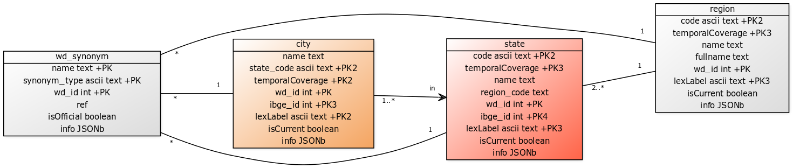

# datasets-br

Describing the datasets-br directives and using this project as [point of generic discussions](https://github.com/datasets-br/datasets-br/issues).

## Dataset-BR directives

1. To post later in the http://datahub.io  ;
2. To unify by curatory process a set of [Wikidata](http://wikidata.org) fragments;
3. [Digital preservation](https://en.wikipedia.org/wiki/Digital_preservation) of the curated data;
5. Monitoring / audit Wikidata and OSM changes abou a stable matrix of curated references.

## Use as an ecosystem of datasets

Example of use with 2 datasets, `br-state` and `br-city`.

...

------

[&#160; Contents and data of this project are dedicated to   ](LICENSE.md)

